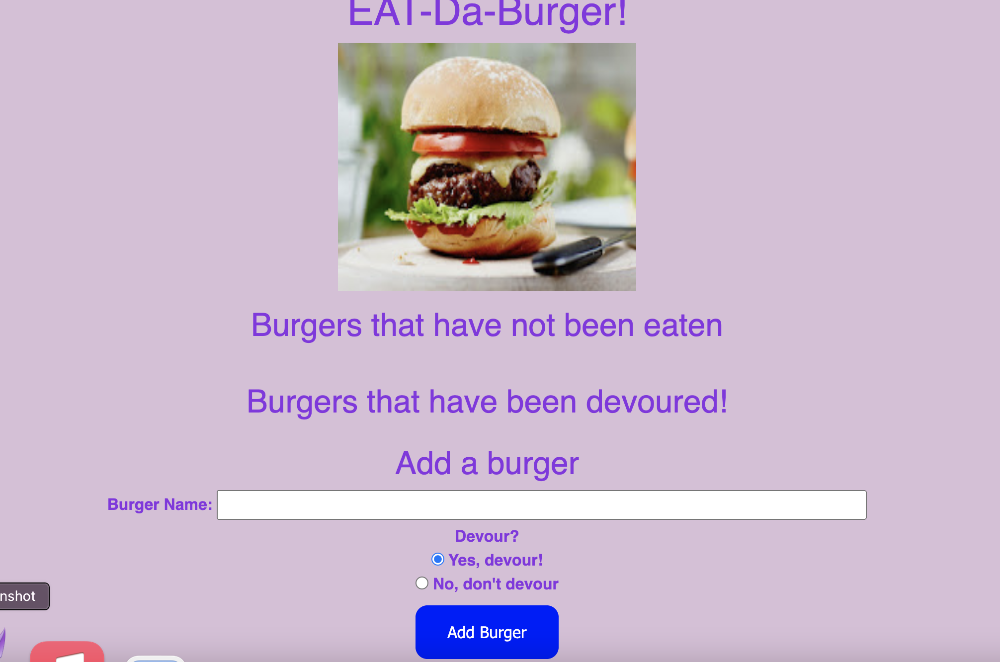

# Burger-Express-App

This is a simple web application that presents the user with a list of burgers that they can choose to eat. The user can also add additional burger names through an input box or delete the existing burgers from the list.

## Functionalities and NPM libraries

The application allows to add or erase burgers to a predefined database hosted in the cloud. To do this the application uses the following npm libraries:

-The code is based on node.js and the nodemon npm server library.

-The code is based on the minimalist express npm library (https://www.npmjs.com/package/express)

-The tables and database were developed on MySql and the npm mysql driver (https://www.npmjs.com/package/mysql)

-The HTML and CSS formatting is executed through the express handlebars package (https://www.npmjs.com/package/express-handlebars)

-The application is hosted externally through the Heroku cloud platform (https://dashboard.heroku.com/) and the Heroku CLI tool (https://devcenter.heroku.com/articles/heroku-cli)

## Demo Pictures and Video showing full functionality

